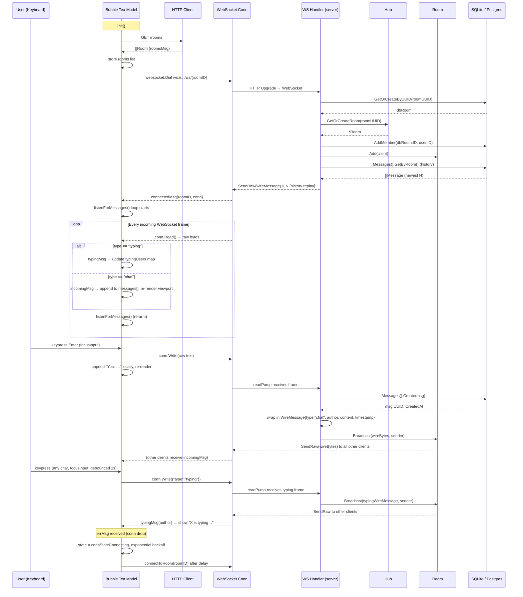

# Data Flow Diagram

```mermaid
sequenceDiagram
    participant U as User (Keyboard)
    participant TUI as Bubble Tea Model
    participant HTTP as HTTP Client
    participant WS as WebSocket Conn
    participant SRV as WS Handler (server)
    participant HUB as Hub
    participant ROOM as Room
    participant DB as SQLite / Postgres

    %% Boot
    Note over TUI: Init()
    TUI->>HTTP: GET /rooms
    HTTP-->>TUI: []Room (roomsMsg)
    TUI->>TUI: store rooms list

    %% Join room (auto on first load)
    TUI->>WS: websocket.Dial ws://.../ws/{roomID}
    WS->>SRV: HTTP Upgrade → WebSocket
    SRV->>DB: GetOrCreateByUUID(roomUUID)
    DB-->>SRV: dbRoom
    SRV->>HUB: GetOrCreateRoom(roomUUID)
    HUB-->>SRV: *Room
    SRV->>DB: AddMember(dbRoom.ID, user.ID)
    SRV->>ROOM: Add(client)
    SRV->>DB: Messages().GetByRoom() (history)
    DB-->>SRV: []Message (newest N)
    SRV-->>WS: SendRaw(wireMessage) × N  [history replay]
    WS-->>TUI: connectedMsg{roomID, conn}
    TUI->>TUI: listenForMessages() loop starts

    %% Receive messages (ongoing loop)
    loop Every incoming WebSocket frame
        WS-->>TUI: conn.Read() → raw bytes
        alt type == "typing"
            TUI->>TUI: typingMsg → update typingUsers map
        else type == "chat"
            TUI->>TUI: incomingMsg → append to messages[], re-render viewport
        end
        TUI->>TUI: listenForMessages() (re-arm)
    end

    %% Send a message
    U->>TUI: keypress Enter (focusInput)
    TUI->>WS: conn.Write(raw text)
    TUI->>TUI: append "You: …" locally, re-render

    WS->>SRV: readPump receives frame
    SRV->>DB: Messages().Create(msg)
    DB-->>SRV: msg.UUID, CreatedAt
    SRV->>SRV: wrap in WireMessage{type:"chat", author, content, timestamp}
    SRV->>ROOM: Broadcast(wireBytes, sender)
    ROOM-->>WS: SendRaw(wireBytes) to all other clients
    WS-->>TUI: (other clients receive incomingMsg)

    %% Typing indicator
    U->>TUI: keypress (any char, focusInput, debounced 2s)
    TUI->>WS: conn.Write({"type":"typing"})
    WS->>SRV: readPump receives typing frame
    SRV->>ROOM: Broadcast(typingWireMessage, sender)
    ROOM-->>WS: SendRaw to other clients
    WS-->>TUI: typingMsg(author) → show "X is typing…"

    %% Reconnect on error
    Note over TUI: errMsg received (conn drop)
    TUI->>TUI: state = connStateConnecting, exponential backoff
    TUI->>WS: connectToRoom(roomID) after delay
```
